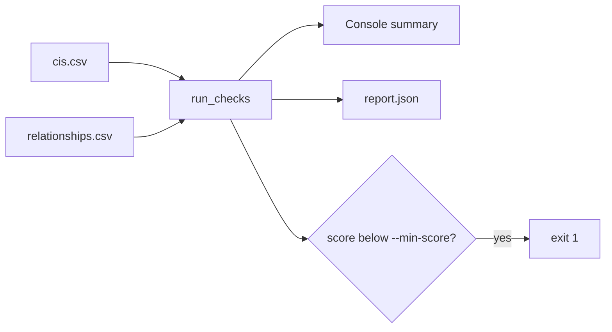

# cmdb-health-checker

Scores a CMDB export for completeness and correctness and lists the CIs that fail, so data problems can be fixed at the source.

> **Portfolio project.** Written independently as a clean-room demonstration. It contains no employer or client code, configuration or data. All sample data is synthetic.

## Business use case

Incident routing, change impact analysis and asset reporting all depend on CMDB data. This tool applies the same ideas as the ServiceNow CMDB Health dashboard (required attributes, duplicates, stale and orphan CIs) to a CSV export. It can run in a pipeline and fail the build when quality drops below a threshold.

## Checks

| Check | Rule |
|---|---|
| Completeness | Required attributes per class, for example a server needs name, serial number, IP address, owner, support group and environment |
| Duplicates | Same serial number (case-insensitive); otherwise same class and name. This mirrors how an identification rule falls back between identifiers |
| Stale | Not discovered within N days (default 60). Retired CIs are excluded. A missing discovery date counts as stale |
| Orphans | Application and database CIs with no relationship to another CI that exists in the export |



## Run it

No dependencies beyond Python 3.11+.

```bash
python -m cmdbhealth --cis sample_data/cis.csv --relationships sample_data/relationships.csv --today 2026-10-01 --json report.json
```

Sample output:

```
CIs checked      : 11
Completeness     : 81.8%  (2 incomplete)
Correctness      : 36.4%  (2 duplicate groups, 2 stale, 2 orphans)
WARNING skipped row: {'line': 13, 'reason': 'missing sys_id or sys_class_name'}
```

Add `--min-score 90` to exit with code 1 when either score is below 90.

## Tests

```bash
python -m unittest discover -s tests -v
```

12 tests, including boundary dates, malformed rows and the expected findings for the sample data.

## Security notes

The sample data is invented: host names, serial numbers, IP addresses (private range) and people are not real. Do not commit real CMDB exports to this repository.

## Limitations and next steps

- Works on exports, not a live instance. Pairing it with `servicenow-table-api-client` would let it pull `cmdb_ci` and `cmdb_rel_ci` directly.
- Required attributes are defined in code. On an instance these belong in CMDB Health settings.
- No compliance (audit) scoring yet.

## License

MIT
